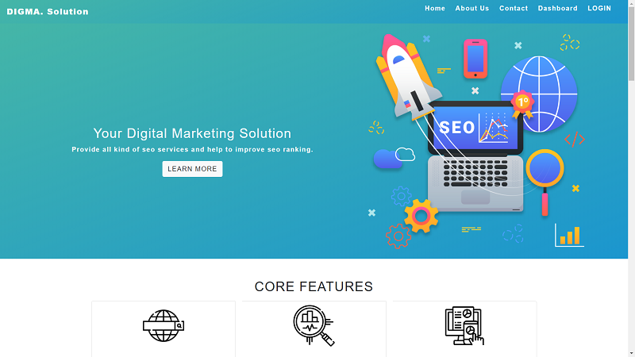
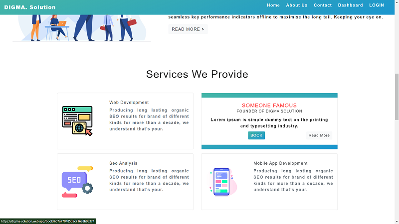
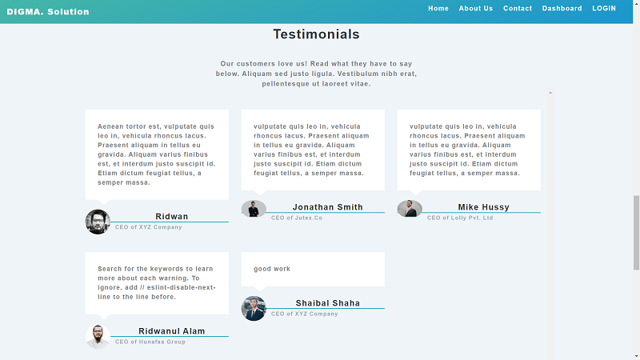
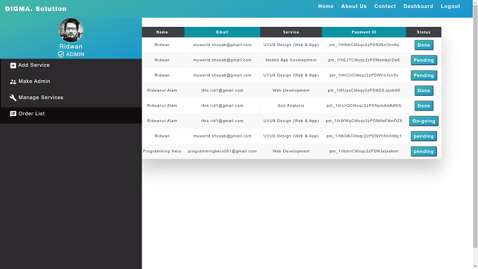
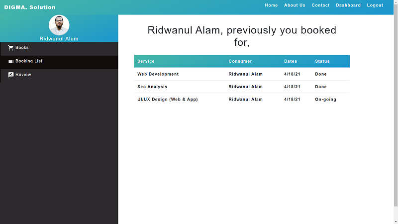

# Project Name: DIGMA Solution 
## By - Mohammad Ridwanul ALam

DIGMA means DIGITAL MARKETING!
A full website for digital marketers!!
This is full stack MERN Project.

## Core Features

- In the HOME page theres six sections named BANNER, Core Features, Services, Testimonials, Contact and Footer. 

- Both Service & Testimonial sections are dynamically connected with mongoDB.

- User can book any services through Stripe payment method by clicking service card. Before that user must ensure to sign in. Otherwise he/she is redirected to the login page.

- Signed in User can go to the DASHBOARD. Dashboard interface created with two separate role Admin & User

- User can review the services from the DASHBOARD. Which will dynamically shown to the home page's Testimonial section.

- Admin get access to change, update & delete the Services & also can change the order status.

- Admin can make new Admin from dashboard through giving email address

# Major Dependencies 
    "axios" 
    "bootstrap" 
    "dateformat"
    "firebase" 
    "react-bootstrap" 
    "react-hook-form" 
    "react-modal" 
    "react-router-dom" 

# noSQl database
    MongoDB
## Live Demo 
[DIGMA-Solution](https://digma-solution.web.app/)

